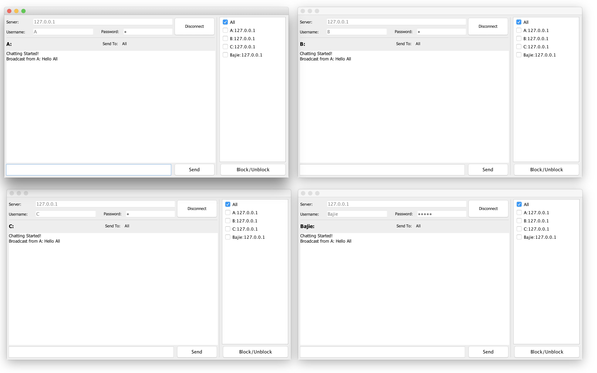
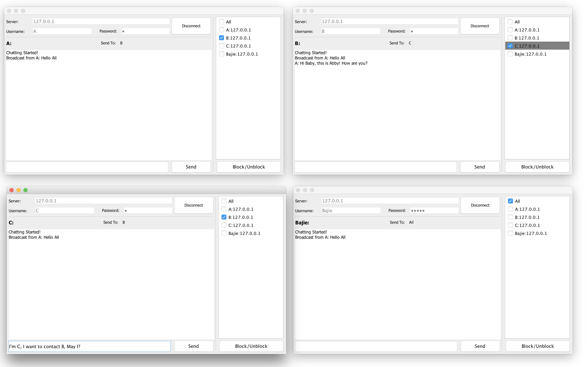

# Java-ChatSystem
> IDE Eclipse Version: Oxygen.1a Release (4.7.1a)  
> java version "1.8.0_144"  
> Java(TM) SE Runtime Environment (build 1.8.0_144-b01)  
> Developer: Chunkai
> [Github](https://github.com/chunkai-meng/Java-ChatSystem)  
> Completed at Oct 2017

## USAGE
- Clone the repository to you local disk
- Run “ChatServer.java” to start Server, please make sure that the 5000 port is not being used.
- Run some copy of “ChatGui.java” so you can send message to each other.
- Input the correct Server IP into Client, by default the server and client running on the same machine, the IP address already set up for you.
- Test Account(Usename/Password):  
A/A  
B/B  
C/C  
Bajie/B1234  

## Functions
### Client:

- Send a basic text message to the server
- Receive text from the server
- Username/Password login  
When account successfully login the login area Test Field will be set to disable, at the same time, the Connect Button text is set to be “Disconnect” waiting for user to disconnect.
- Display IP address/nickname of other chat clients
- Private messaging between users  
  - Design  
  By select a contact from the User List, the message will only be delivered to that person.  
  - Implementation:  
  When sending a private message, the first msg being sent to server is of type: CHAT_MESSAGE. The second msg is the receiver name, the third msg is message itself.
The corresponding ClientHandler Thread maintain a total Client List will forward it to the right person.
- Block/ignore user  

  - Design:  
  When chose a user and click “Block/Unblock” button, this user will be block in this client.Right after the click, the background color of Blocked-User cell is set to Color Gray.If user A is block by user B, A will not received any notice about this blocking, this is for protecting B’s privacy.
  - Implementation:  
  Each Client maintain two BlockUser ArrayList variables, one is the index of block-user in JList which is used to highlight cell, another ArrayList restore the block-user name for checking the incoming msg.
- Enhanced GUI JList  
  - Design:
  A checkbox is added to JList Cell to help distinguish select user and blocked user. The Checkbox always represent the current chatting friend. One Client can block as many users as it want.
  - Implementation:
  A CheckboxListCellRenderer class is use to render JList cells, this object is help render different cell background for the blocked users.

### Server:
- Listen to the default 5000 port and create a new thread for each new connection.
- Receive text from a client
- Broadcast a text message received from a client to all the other clients connected to the server.
- Send the message to the specific person if Messge type is "CHAT_MESSAGE" and receiver is provided.
- When a new user is connected or an online user logout, broadcast the new online user list to all online accounts.

## Documents Description
- ChatServer.java: The entry of the Server Application, run this app to start server
- ChatGui.java:     The entry point of Chat Client,  run some of these app to start chatting.
- ClientHandler.java: One ClientHandler thread serve one client.
- readByLine.java:    Read registered user data from UserModel.txt (Restore Username and password)
- ServerConstants.java: Restore the constant variables which are used to defined the message type.
- run.sh is a bash script to recompile and run the server app.
